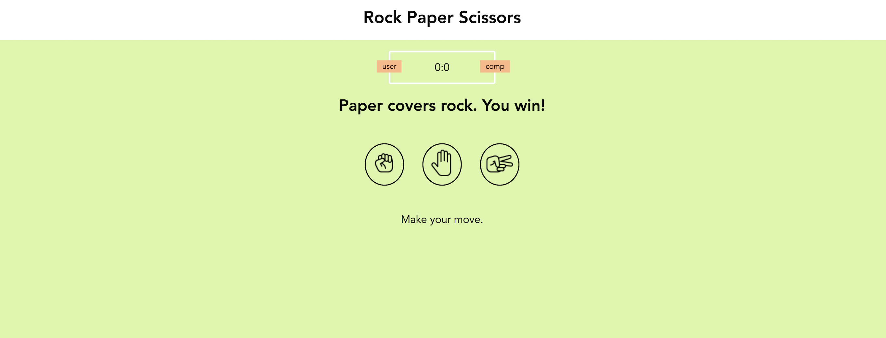

# Rock Paper Scissors

This is a classic game that every programmer start off with to build their JS knowledge. This game against the computer will allow you to play rock paper scissors and keep track of the scores. 

## Application Features
- User can play game
- Computer will make random selection 
- Player scores will be kept
- Win/lose/tie animations

## Built With
- Ruby
- Rails framework with MVC architecture
- SQLite3 as the database for Active Record
- CSS for styling

## Install Instructions
- Clone this repo to your local machine git clone
- run `bundle install` to install required dependencies
- run `rails db:create` to create a database locally.
- run `rails db:migrate` to create tables into the database.
- run `rails db:seed` to create seed data.
- run `rails s` to run the server.

## Future Implementations
- Quiz feature that suggests plants to User 
- Online shop that links to local florists 

## Challenges 
Timing and figuring out the back end! We found ourselves in the last moments trying to solve some major issues in our forms and having them work properly. Thankfully after some brain storming and collective thinking, we found an alternative to make it work. 

## Authors
- Alexa Botello
- Nicole Uyigue-Sivek
